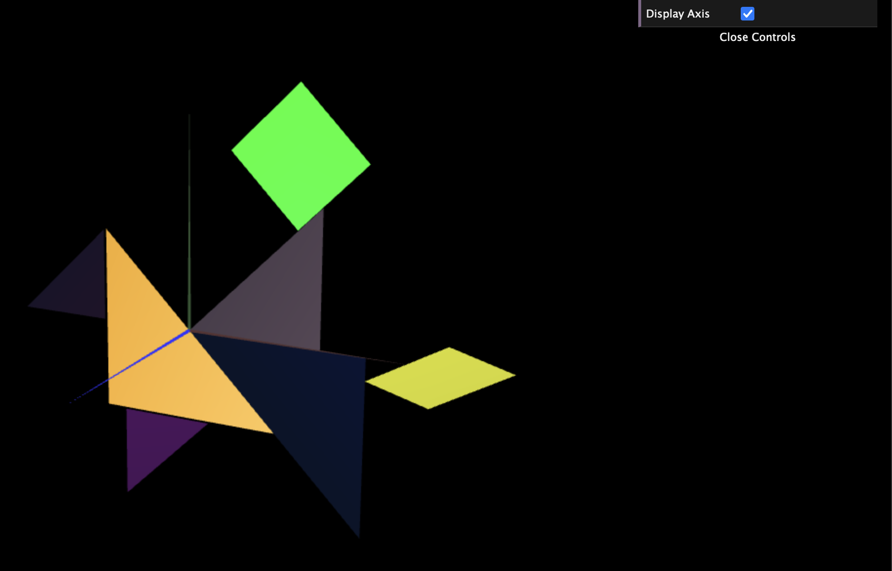
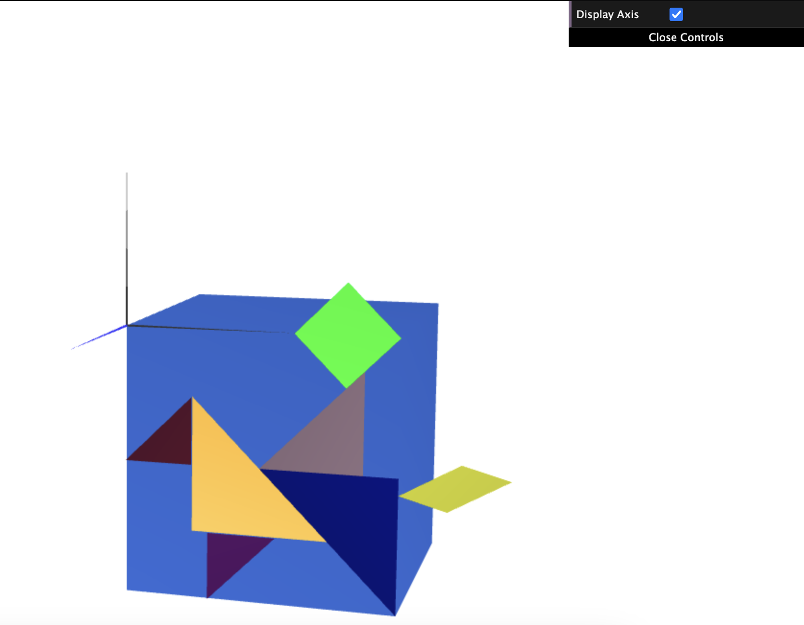
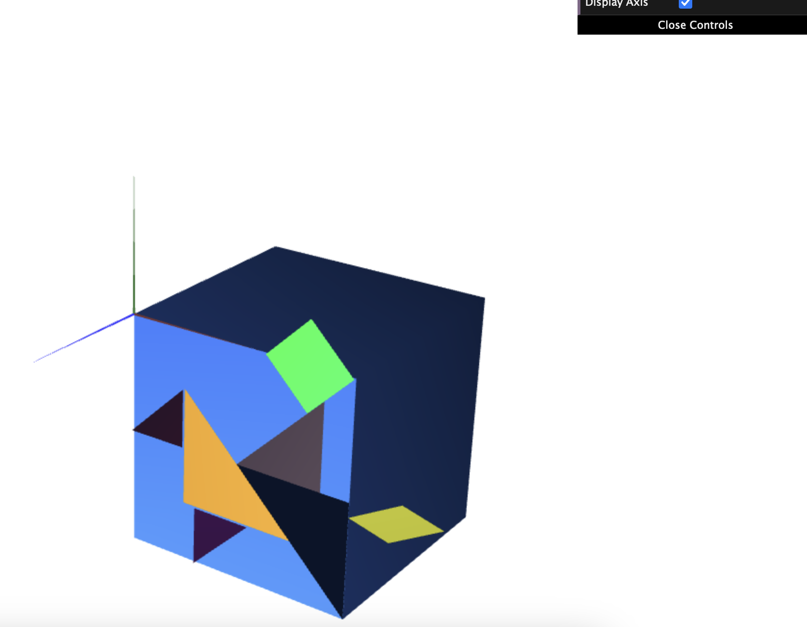

# CG 2023/2024

## Group T01G12

## TP 2 Notes

(add your main observations/remarks about your experiments here, in a bulleted list, and remove this line. Some examples below)

- In exercise 1 we observed X
- In exercise 2 we had difficulties in Y

In the third screenshot, the big cube sides' are quads.

